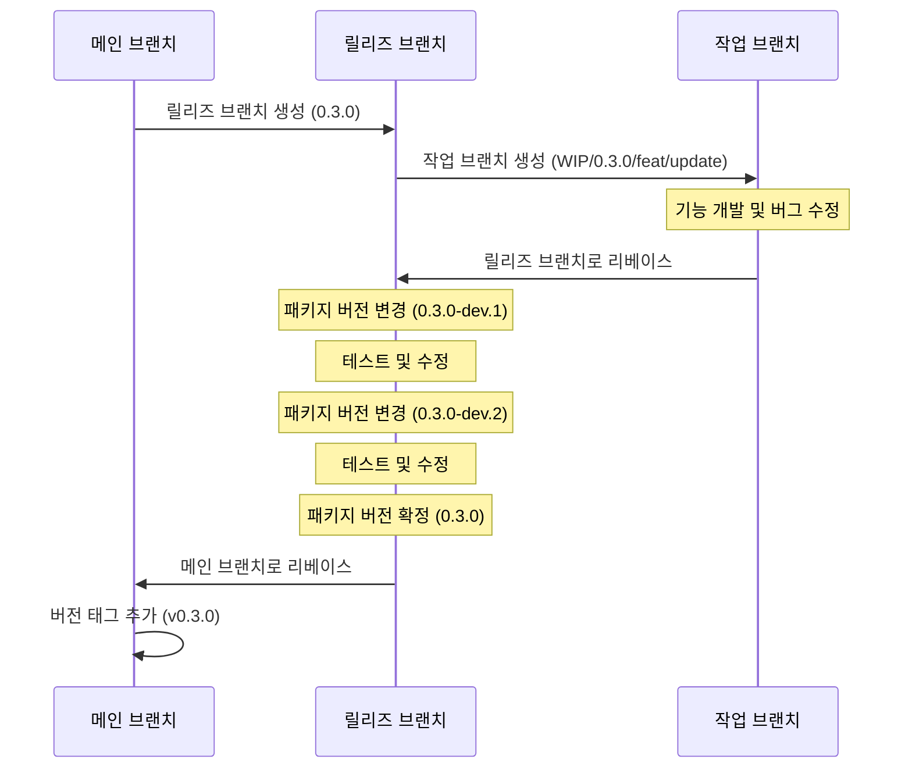

# Context Query

[English Documentation](./README.md)

리액트 애플리케이션을 위한 가볍고 효율적인 상태 관리 라이브러리로, 컴포넌트 트리 범위의 상태를 최적화된 렌더링과 함께 제공합니다.

## Context Query를 개발한 이유

리액트는 상태 관리를 위한 여러 방법을 제공하지만, 각각은 특정 시나리오에서 한계가 있습니다:

1. **전역 상태(Redux, Zustand)**는 애플리케이션 전체 데이터 공유를 목적으로 하기 때문에 특정 컴포넌트 트리 내에서 상태를 공유하기에 적합하지 않습니다. 또한 컴포넌트 라이프사이클에 따라 상태를 관리하는 것은 매우 어렵습니다.

2. **React Context API**는 컴포넌트 트리 내에서 스코프를 가지는 상태를 생성하지만, 컨텍스트의 어떤 부분이 변경되더라도 모든 하위 컴포넌트에 불필요한 리렌더링을 발생시킵니다.

3. **React Query**는 서버 상태 관리에 탁월하지만 전역적인 키 기반 접근 방식을 사용하여 컴포넌트 범위의 클라이언트 상태에는 이상적이지 않습니다.

Context Query는 이러한 접근 방식의 장점을 결합합니다:

- **컴포넌트 트리 스코핑**: Context API처럼 상태가 컴포넌트 라이프사이클과 연결됩니다
- **구독 모델**: React Query처럼 특정 상태 키를 구독하는 컴포넌트만 리렌더링됩니다
- **간단한 API**: React의 `useState`와 유사한 친숙한 훅 기반 패턴을 제공합니다

## Context Query 사용 시기

Context Query는 다음과 같은 경우에 이상적입니다:

- **컴포넌트 그룹화**: 프롭스 드릴링 없이 여러 컴포넌트 간에 상태를 공유해야 할 때
- **컴포넌트 범위 상태**: 상태가 특정 컴포넌트 트리의 라이프사이클과 연결되어야 할 때
- **성능이 중요한 UI**: 복잡한 컴포넌트 계층에서 리렌더링을 최소화해야 할 때

### 상태 관리 도구의 올바른 선택

Context Query는 모든 상황에 적합한 만능 솔루션이 아닙니다. 최적의 성능과 아키텍처를 위해 용도에 맞는 상태 관리 도구를 선택하세요:

- **전역 상태 관리(Redux, Zustand)**: 앱 전체에 걸쳐 유지되어야 하는 진정한 애플리케이션 전체 상태에 사용하세요
- **React Query**: 주 목적인 서버 상태 관리 및 데이터 페칭에 사용하세요
- **Context API**: 테마 변경, 로케일 설정 또는 모든 하위 컴포넌트의 리렌더링을 의도적으로 원하는 경우에 사용하세요
- **Context Query**: 프롭스 드릴링 없이 컴포넌트 트리 범위의 상태 공유가 필요하면서 불필요한 형제 컴포넌트 리렌더링은 방지하고 싶을 때 사용하세요

## 특징

- 🚀 **세밀한 리렌더링**: 구독한 특정 상태가 변경될 때만 컴포넌트가 리렌더링됩니다
- 🔄 **컴포넌트 라이프사이클 통합**: 프로바이더 컴포넌트가 언마운트되면 상태가 자동으로 정리됩니다
- 🔌 **간단한 API**: React의 `useState`와 유사한 친숙한 훅 기반 API
- 🧩 **타입스크립트 지원**: 타입스크립트로 완전한 타입 안전성 제공
- 📦 **경량**: 의존성 없는 최소한의 번들 크기
- 🔧 **호환성**: 기존 상태 관리 솔루션과 함께 사용 가능

## 설치

```bash
# npm 사용
npm install @context-query/react

# yarn 사용
yarn add @context-query/react

# pnpm 사용
pnpm add @context-query/react
```

## 사용법

### 1. Context Query Provider 생성

```tsx
// CounterContextQueryProvider.tsx
import { createContextQuery } from "@context-query/react";

type CounterAtoms = {
  primaryCounter: {
    name: string;
    value: number;
    description: string;
  };
  secondaryCounter: {
    name: string;
    value: number;
    description: string;
  };
};

export const {
  ContextQueryProvider: CounterQueryProvider,
  useContextAtom: useCounterAtom,
  useContextAtomValue: useCounterAtomValue,
  useContextSetAtom: useCounterSetAtom,
} = createContextQuery<CounterAtoms>();
```

### 2. Provider로 컴포넌트 트리 감싸기 및 Atom 초기화

```tsx
// CounterApp.tsx
import { CounterQueryProvider } from "./CounterContextQueryProvider";

function CounterApp() {
  return (
    <CounterQueryProvider
      atoms={{
        primaryCounter: {
          name: "메인 카운터",
          value: 0,
          description: "다른 카운터들을 제어하는 메인 카운터",
        },
        secondaryCounter: {
          name: "보조 카운터",
          value: 0,
          description: "메인 카운터와 연동되는 보조 카운터",
        },
      }}
    >
      <CounterContent />
    </CounterQueryProvider>
  );
}

function CounterContent() {
  return (
    <div className="counter-app">
      <PrimaryCounterComponent />
      <SecondaryCounterComponent />
    </div>
  );
}
```

### 3. 컴포넌트에서 Atom 사용하기

```tsx
// PrimaryCounterComponent.tsx
import { useCounterAtom, useCounterSetAtom } from "./CounterContextQueryProvider";

function PrimaryCounterComponent() {
  // primary counter atom만 구독
  const [primaryCounter, setPrimaryCounter] = useCounterAtom("primaryCounter");
  const setSecondaryCounter = useCounterSetAtom("secondaryCounter");

  const increment = () => {
    setPrimaryCounter((prev) => ({ ...prev, value: prev.value + 1 }));
    // 보조 카운터도 함께 업데이트
    setSecondaryCounter((prev) => ({ ...prev, value: prev.value + 1 }));
  };

  const decrement = () => {
    setPrimaryCounter((prev) => ({ ...prev, value: prev.value - 1 }));
  };

  const reset = () => {
    setPrimaryCounter((prev) => ({ ...prev, value: 0 }));
  };

  return (
    <div className="counter">
      <h2>{primaryCounter.name}</h2>
      <p>{primaryCounter.description}</p>
      <div className="counter-controls">
        <span>{primaryCounter.value}</span>
        <button onClick={decrement}>-</button>
        <button onClick={increment}>+</button>
        <button onClick={reset}>초기화</button>
      </div>
    </div>
  );
}

// SecondaryCounterComponent.tsx
import { useCounterAtomValue } from "./CounterContextQueryProvider";

function SecondaryCounterComponent() {
  // secondary counter atom에 대한 읽기 전용 액세스
  const secondaryCounter = useCounterAtomValue("secondaryCounter");

  return (
    <div className="counter secondary">
      <h3>{secondaryCounter.name}</h3>
      <p>{secondaryCounter.description}</p>
      <div className="counter-display">
        <span>{secondaryCounter.value}</span>
      </div>
    </div>
  );
}

// BatchUpdateComponent.tsx
import { useCounterSetAtom } from "./CounterContextQueryProvider";

function BatchUpdateComponent() {
  const setPrimaryCounter = useCounterSetAtom("primaryCounter");
  const setSecondaryCounter = useCounterSetAtom("secondaryCounter");

  const resetAll = () => {
    setPrimaryCounter((prev) => ({ ...prev, value: 0 }));
    setSecondaryCounter((prev) => ({ ...prev, value: 0 }));
  };

  const incrementAll = () => {
    setPrimaryCounter((prev) => ({ ...prev, value: prev.value + 1 }));
    setSecondaryCounter((prev) => ({ ...prev, value: prev.value + 1 }));
  };

  return (
    <div className="batch-controls">
      <button onClick={resetAll}>모든 카운터 초기화</button>
      <button onClick={incrementAll}>모든 카운터 증가</button>
    </div>
  );
}
```

이 예시는 다음을 보여줍니다:

1. **Atom 기반 아키텍처**: 각 상태 조각이 별도의 atom으로 관리됨
2. **세밀한 구독**: 컴포넌트는 필요한 atom만 구독하여 리렌더링을 최적화
3. **읽기-쓰기 분리**: 읽기-쓰기 액세스는 `useContextAtom`, 읽기 전용은 `useContextAtomValue`, 쓰기 전용은 `useContextSetAtom` 사용
4. **Atom 간 업데이트**: 컴포넌트는 여러 atom을 독립적으로 업데이트 가능

## 고급 사용법

### 사용 가능한 훅들

`createContextQuery` 함수는 서로 다른 사용 사례를 위한 세 가지 훅을 반환합니다:

```tsx
const {
  ContextQueryProvider,
  useContextAtom,        // atom에 대한 읽기-쓰기 액세스
  useContextAtomValue,   // atom에 대한 읽기 전용 액세스
  useContextSetAtom,     // atom에 대한 쓰기 전용 액세스
} = createContextQuery<YourAtomTypes>();
```

### 훅 사용 패턴

#### `useContextAtom` - 읽기 & 쓰기
```tsx
function CounterComponent() {
  const [counter, setCounter] = useContextAtom("counter");
  
  const increment = () => {
    setCounter((prev) => ({ ...prev, value: prev.value + 1 }));
  };
  
  return (
    <div>
      <span>{counter.value}</span>
      <button onClick={increment}>+</button>
    </div>
  );
}
```

#### `useContextAtomValue` - 읽기 전용
```tsx
function DisplayComponent() {
  const counter = useContextAtomValue("counter");
  
  return <div>현재 값: {counter.value}</div>;
}
```

#### `useContextSetAtom` - 쓰기 전용
```tsx
function ControlComponent() {
  const setCounter = useContextSetAtom("counter");
  
  const reset = () => {
    setCounter((prev) => ({ ...prev, value: 0 }));
  };
  
  return <button onClick={reset}>초기화</button>;
}
```

### 함수형 업데이트

React의 `useState`와 유사하게, atom 설정자에 함수를 전달할 수 있습니다:

```tsx
const [counter, setCounter] = useContextAtom("counter");

// 이전 상태를 기반으로 업데이트
const increment = () => {
  setCounter((prev) => ({ ...prev, value: prev.value + 1 }));
};
```

### 다중 프로바이더

동일한 프로바이더를 여러 번 사용하면 각각 독립적인 상태를 가집니다:

```tsx
function App() {
  return (
    <div>
      {/* 첫 번째 카운터 인스턴스 */}
      <CounterQueryProvider atoms={{ counter: { value: 0, name: "첫 번째 카운터" } }}>
        <CounterSection title="첫 번째 구역" />
      </CounterQueryProvider>

      {/* 두 번째 카운터 인스턴스 (완전히 독립적) */}
      <CounterQueryProvider atoms={{ counter: { value: 10, name: "두 번째 카운터" } }}>
        <CounterSection title="두 번째 구역" />
      </CounterQueryProvider>
    </div>
  );
}

function CounterSection({ title }) {
  const [counter, setCounter] = useCounterAtom("counter");
  
  return (
    <div>
      <h2>{title}</h2>
      <p>{counter.name}: {counter.value}</p>
      <button onClick={() => setCounter(prev => ({ ...prev, value: prev.value + 1 }))}>
        증가
      </button>
    </div>
  );
}
```

각 프로바이더는 자체 상태를 가지므로 한 쪽의 카운터를 변경해도 다른 쪽에 영향을 주지 않습니다.

## 프로젝트 구조

이 프로젝트는 여러 패키지로 구성되어 있습니다:

- `@context-query/core`: 핵심 기능 및 상태 관리
- `@context-query/react`: React 바인딩 및 훅
- `playground`: 라이브러리 사용 예제 애플리케이션

## 개발

### 필수 조건

- Node.js >= 18
- pnpm >= 9.0.0

### 설정

```bash
# 저장소 복제
git clone https://github.com/load28/context-query.git
cd context-query

# 의존성 설치
pnpm install

# 모든 패키지 빌드
pnpm build

# 플레이그라운드 데모 실행
pnpm playground
```

## 릴리즈 워크플로우



## 라이선스

MIT
