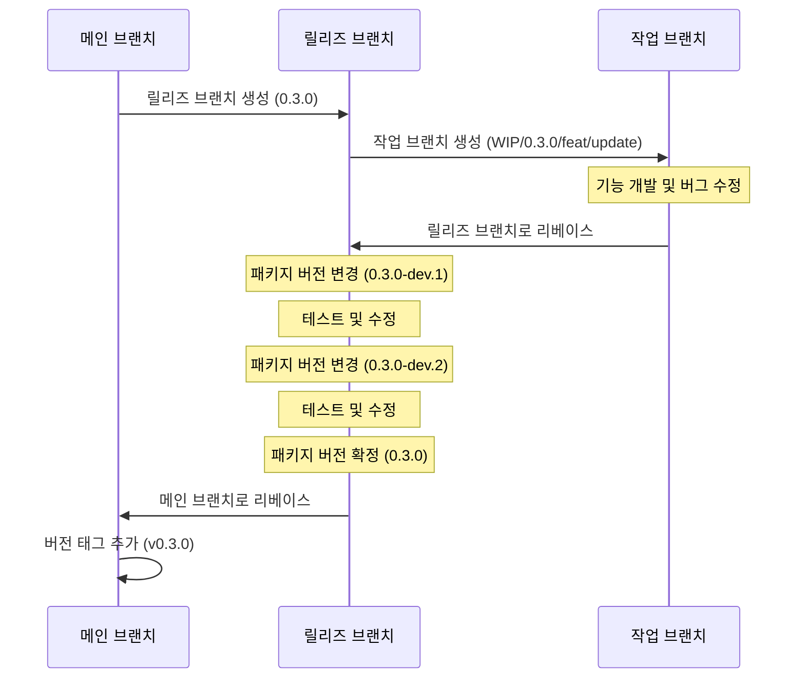

# Context Query

[English Documentation](./README.md)

리액트 애플리케이션을 위한 가볍고 효율적인 상태 관리 라이브러리로, 컴포넌트 트리 범위의 상태를 최적화된 렌더링과 함께 제공합니다.

## Context Query를 개발한 이유

리액트는 상태 관리를 위한 여러 방법을 제공하지만, 각각은 특정 시나리오에서 한계가 있습니다:

1. **전역 상태(Redux, Zustand)**는 애플리케이션 전체 데이터 공유를 목적으로 하기 때문에 특정 컴포넌트 트리 내에서 상태를 공유하기에 적합하지 않습니다. 또한 컴포넌트 라이프사이클에 따라 상태를 관리하는 것은 매우 어렵습니다.

2. **React Context API**는 컴포넌트 트리 내에서 스코프를 가지는 상태를 생성하지만, 컨텍스트의 어떤 부분이 변경되더라도 모든 하위 컴포넌트에 불필요한 리렌더링을 발생시킵니다.

3. **React Query**는 서버 상태 관리에 탁월하지만 전역적인 키 기반 접근 방식을 사용하여 컴포넌트 범위의 클라이언트 상태에는 이상적이지 않습니다.

Context Query는 이러한 접근 방식의 장점을 결합합니다:

- **컴포넌트 트리 스코핑**: Context API처럼 상태가 컴포넌트 라이프사이클과 연결됩니다
- **구독 모델**: React Query처럼 특정 상태 키를 구독하는 컴포넌트만 리렌더링됩니다
- **간단한 API**: React의 `useState`와 유사한 친숙한 훅 기반 패턴을 제공합니다

## Context Query 사용 시기

Context Query는 다음과 같은 경우에 이상적입니다:

- **컴포넌트 그룹화**: 프롭스 드릴링 없이 여러 컴포넌트 간에 상태를 공유해야 할 때
- **컴포넌트 범위 상태**: 상태가 특정 컴포넌트 트리의 라이프사이클과 연결되어야 할 때
- **성능이 중요한 UI**: 복잡한 컴포넌트 계층에서 리렌더링을 최소화해야 할 때

### 상태 관리 도구의 올바른 선택

Context Query는 모든 상황에 적합한 만능 솔루션이 아닙니다. 최적의 성능과 아키텍처를 위해 용도에 맞는 상태 관리 도구를 선택하세요:

- **전역 상태 관리(Redux, Zustand)**: 앱 전체에 걸쳐 유지되어야 하는 진정한 애플리케이션 전체 상태에 사용하세요
- **React Query**: 주 목적인 서버 상태 관리 및 데이터 페칭에 사용하세요
- **Context API**: 테마 변경, 로케일 설정 또는 모든 하위 컴포넌트의 리렌더링을 의도적으로 원하는 경우에 사용하세요
- **Context Query**: 프롭스 드릴링 없이 컴포넌트 트리 범위의 상태 공유가 필요하면서 불필요한 형제 컴포넌트 리렌더링은 방지하고 싶을 때 사용하세요

## 특징

- 🚀 **세밀한 리렌더링**: 구독한 특정 상태가 변경될 때만 컴포넌트가 리렌더링됩니다
- 🔄 **컴포넌트 라이프사이클 통합**: 프로바이더 컴포넌트가 언마운트되면 상태가 자동으로 정리됩니다
- 🔌 **간단한 API**: React의 `useState`와 유사한 친숙한 훅 기반 API
- 🧩 **타입스크립트 지원**: 타입스크립트로 완전한 타입 안전성 제공
- 📦 **경량**: 의존성 없는 최소한의 번들 크기
- 🔧 **호환성**: 기존 상태 관리 솔루션과 함께 사용 가능

## 설치

```bash
# npm 사용
npm install @context-query/react

# yarn 사용
yarn add @context-query/react

# pnpm 사용
pnpm add @context-query/react
```

## 사용법

### 1. Context Query Provider 생성

```tsx
// UserContextQueryProvider.tsx
import { createContextQuery } from "@context-query/react";

interface UserData {
  name: string;
  email: string;
  preferences: {
    theme: "light" | "dark";
    notifications: boolean;
  };
}

export const {
  Provider: UserQueryProvider,
  useContextQuery: useUserQuery,
  updateState: updateUserState,
  setState: setUserState,
} = createContextQuery<UserData>({
  name: "",
  email: "",
  preferences: {
    theme: "light",
    notifications: true,
  },
});
```

### 2. Provider로 컴포넌트 트리 감싸기 및 상태 초기화

```tsx
// UserProfilePage.tsx
import { UserQueryProvider, updateUserState } from "./UserContextQueryProvider";

async function fetchUserData(userId: string) {
  const response = await fetch(`/api/users/${userId}`);
  return response.json();
}

function UserProfilePage({ userId }: { userId: string }) {
  useEffect(() => {
    // 외부 데이터로 상태 초기화
    const loadUserData = async () => {
      const userData = await fetchUserData(userId);
      updateUserState(userData); // 가져온 데이터로 전체 상태 업데이트
    };
    loadUserData();
  }, [userId]);

  return (
    <UserQueryProvider>
      <div className="user-profile">
        <UserInfoForm />
        <UserPreferencesForm />
        <SaveButton />
      </div>
    </UserQueryProvider>
  );
}
```

### 3. 컴포넌트에서 상태 사용하기

```tsx
// UserInfoForm.tsx
import { useUserQuery } from "./UserContextQueryProvider";

function UserInfoForm() {
  // 사용자 정보 필드만 구독
  const [state, setState] = useUserQuery(["name", "email"]);

  return (
    <div className="user-info">
      <h3>기본 정보</h3>
      <div>
        <label>이름:</label>
        <input
          value={state.name}
          onChange={(e) =>
            setState((prev) => ({ ...prev, name: e.target.value }))
          }
        />
      </div>
      <div>
        <label>이메일:</label>
        <input
          value={state.email}
          onChange={(e) =>
            setState((prev) => ({ ...prev, email: e.target.value }))
          }
        />
      </div>
    </div>
  );
}

// UserPreferencesForm.tsx
import { useUserQuery } from "./UserContextQueryProvider";

function UserPreferencesForm() {
  // preferences만 구독
  const [state, setState] = useUserQuery(["preferences"]);

  const toggleTheme = () => {
    setState((prev) => ({
      ...prev,
      preferences: {
        ...prev.preferences,
        theme: prev.preferences.theme === "light" ? "dark" : "light",
      },
    }));
  };

  const toggleNotifications = () => {
    setState((prev) => ({
      ...prev,
      preferences: {
        ...prev.preferences,
        notifications: !prev.preferences.notifications,
      },
    }));
  };

  return (
    <div className="user-preferences">
      <h3>사용자 설정</h3>
      <div>
        <label>테마: {state.preferences.theme}</label>
        <button onClick={toggleTheme}>테마 변경</button>
      </div>
      <div>
        <label>
          <input
            type="checkbox"
            checked={state.preferences.notifications}
            onChange={toggleNotifications}
          />
          알림 활성화
        </label>
      </div>
    </div>
  );
}

// SaveButton.tsx
import { useUserQuery, updateUserState } from "./UserContextQueryProvider";

function SaveButton() {
  // 저장을 위해 모든 사용자 데이터 가져오기
  const [userData] = useUserQuery(["name", "email", "preferences"]);

  const handleSave = async () => {
    try {
      const response = await fetch("/api/users/update", {
        method: "POST",
        body: JSON.stringify(userData),
      });
      const updatedUser = await response.json();

      // 서버 응답으로 전체 상태 업데이트
      updateUserState(updatedUser);
    } catch (error) {
      console.error("사용자 데이터 저장 실패:", error);
    }
  };

  return <button onClick={handleSave}>변경사항 저장</button>;
}
```

이 예시는 다음을 보여줍니다:

1. 사용자 정보와 환경설정을 별도의 컴포넌트로 분리하여 관심사를 분리
2. 각 컴포넌트는 필요한 상태만 구독하여 리렌더링을 최적화
3. 컴포넌트들이 독립적으로 자신의 관련 상태를 업데이트

## 고급 사용법

### 함수형 업데이트

React의 `useState`와 유사하게, 상태 설정자에 함수를 전달할 수 있습니다:

```tsx
const [count, setCount] = useCounterQuery(["count1"]);

// 이전 상태를 기반으로 업데이트
const increment = () => {
  setCount((prevCount) => prevCount + 1);
};
// ...
```

### 다중 상태 업데이트

updateState 함수를 사용하여 여러 상태를 한 번에 업데이트할 수 있습니다:

```tsx
import { updateCounterState } from "./CounterContextQueryProvider";

// 여러 상태를 한 번에 업데이트
const resetCounters = () => {
  updateCounterState({
    count1: 0,
    count2: 0,
  });
};
```

### 다중 프로바이더

서로 다른 컴포넌트 트리에 대해 여러 프로바이더를 사용할 수 있습니다:

```tsx
function App() {
  return (
    <div>
      <FeatureAProvider>
        <FeatureAComponents />
      </FeatureAProvider>

      <FeatureBProvider>
        <FeatureBComponents />
      </FeatureBProvider>
    </div>
  );
}
```

## 프로젝트 구조

이 프로젝트는 여러 패키지로 구성되어 있습니다:

- `@context-query/core`: 핵심 기능 및 상태 관리
- `@context-query/react`: React 바인딩 및 훅
- `playground`: 라이브러리 사용 예제 애플리케이션

## 개발

### 필수 조건

- Node.js >= 18
- pnpm >= 9.0.0

### 설정

```bash
# 저장소 복제
git clone https://github.com/load28/context-query.git
cd context-query

# 의존성 설치
pnpm install

# 모든 패키지 빌드
pnpm build
```

## 릴리즈 워크플로우



## 라이선스

MIT
