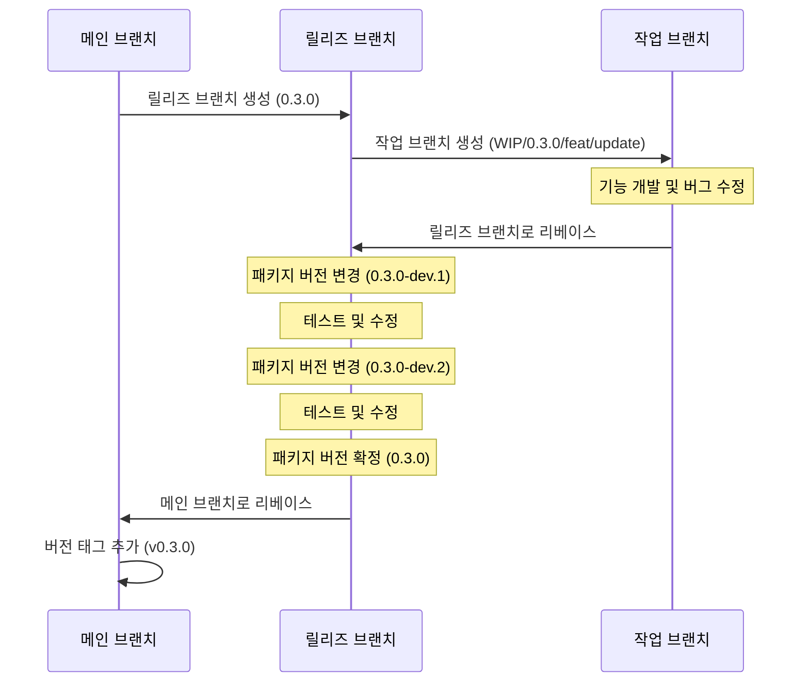

# Context Query

[English Documentation](./README.md)

리액트 애플리케이션을 위한 가볍고 효율적인 상태 관리 라이브러리로, 컴포넌트 트리 범위의 상태를 최적화된 렌더링과 함께 제공합니다.

## Context Query를 개발한 이유

리액트는 상태 관리를 위한 여러 방법을 제공하지만, 각각은 특정 시나리오에서 한계가 있습니다:

1. **전역 상태(Redux, Zustand)**는 애플리케이션 전체 데이터 공유를 목적으로 하기 때문에 특정 컴포넌트 트리 내에서 상태를 공유하기에 적합하지 않습니다. 또한 컴포넌트 라이프사이클에 따라 상태를 관리하는 것은 매우 어렵습니다.

2. **React Context API**는 컴포넌트 트리 내에서 스코프를 가지는 상태를 생성하지만, 컨텍스트의 어떤 부분이 변경되더라도 모든 하위 컴포넌트에 불필요한 리렌더링을 발생시킵니다.

3. **React Query**는 서버 상태 관리에 탁월하지만 전역적인 키 기반 접근 방식을 사용하여 컴포넌트 범위의 클라이언트 상태에는 이상적이지 않습니다.

Context Query는 이러한 접근 방식의 장점을 결합합니다:

- **컴포넌트 트리 스코핑**: Context API처럼 상태가 컴포넌트 라이프사이클과 연결됩니다
- **구독 모델**: React Query처럼 특정 상태 키를 구독하는 컴포넌트만 리렌더링됩니다
- **간단한 API**: React의 `useState`와 유사한 친숙한 훅 기반 패턴을 제공합니다

## Context Query 사용 시기

Context Query는 다음과 같은 경우에 이상적입니다:

- **컴포넌트 그룹화**: 프롭스 드릴링 없이 여러 컴포넌트 간에 상태를 공유해야 할 때
- **컴포넌트 범위 상태**: 상태가 특정 컴포넌트 트리의 라이프사이클과 연결되어야 할 때
- **성능이 중요한 UI**: 복잡한 컴포넌트 계층에서 리렌더링을 최소화해야 할 때

### 상태 관리 도구의 올바른 선택

Context Query는 모든 상황에 적합한 만능 솔루션이 아닙니다. 최적의 성능과 아키텍처를 위해 용도에 맞는 상태 관리 도구를 선택하세요:

- **전역 상태 관리(Redux, Zustand)**: 앱 전체에 걸쳐 유지되어야 하는 진정한 애플리케이션 전체 상태에 사용하세요
- **React Query**: 주 목적인 서버 상태 관리 및 데이터 페칭에 사용하세요
- **Context API**: 테마 변경, 로케일 설정 또는 모든 하위 컴포넌트의 리렌더링을 의도적으로 원하는 경우에 사용하세요
- **Context Query**: 프롭스 드릴링 없이 컴포넌트 트리 범위의 상태 공유가 필요하면서 불필요한 형제 컴포넌트 리렌더링은 방지하고 싶을 때 사용하세요

## 특징

- 🚀 **세밀한 리렌더링**: 구독한 특정 상태가 변경될 때만 컴포넌트가 리렌더링됩니다
- ⚡ **시그널 기반 반응형 엔진**: [TC39 Signals](https://github.com/tc39/proposal-signals) 및 [Alien Signals](https://github.com/nicepkg/alien-signals)에서 영감받은 Push-Pull 하이브리드 반응성
- 🔄 **컴포넌트 라이프사이클 통합**: 프로바이더 컴포넌트가 언마운트되면 상태가 자동으로 정리됩니다
- 🧮 **파생 상태**: Diamond Problem 해결 및 지연 평가를 지원하는 자동 계산 값
- 🔌 **간단한 API**: React의 `useState`와 유사한 친숙한 훅 기반 API
- 🧩 **타입스크립트 지원**: 타입스크립트로 완전한 타입 안전성 제공
- 📦 **경량**: ~2.8KB gzipped (core), 의존성 없음
- 🔧 **호환성**: 기존 상태 관리 솔루션과 함께 사용 가능

## 설치

```bash
# npm 사용
npm install @context-query/react

# yarn 사용
yarn add @context-query/react

# pnpm 사용
pnpm add @context-query/react
```

## 사용법

### 1. Provider 정의하기

```tsx
// TodoProvider.tsx
import { createContextQuery } from "@context-query/react";
import { derived, atom } from "@context-query/core";
import { shallowEqual } from "@context-query/core";

type Todo = { id: number; text: string; done: boolean };

type TodoAtoms = {
  todos: Todo[];
  filter: "all" | "active" | "done";
  filteredTodos: Todo[];
  stats: { total: number; active: number; done: number };
};

export const {
  ContextQueryProvider: TodoProvider,
  useContextAtom: useTodoAtom,
  useContextAtomValue: useTodoValue,
  useContextSetAtom: useTodoSet,
} = createContextQuery<TodoAtoms>();
```

### 2. Atom, 파생 상태, 커스텀 동등성 비교로 초기화

```tsx
// App.tsx
import { TodoProvider } from "./TodoProvider";
import { derived, atom } from "@context-query/core";
import { shallowEqual } from "@context-query/core";

function App() {
  return (
    <TodoProvider
      atoms={{
        todos: atom([] as Todo[], { equalityFn: shallowEqual }),
        filter: "all",
        // 파생 상태: todos + filter에서 자동 계산
        filteredTodos: derived((get) => {
          const todos = get("todos");
          const filter = get("filter");
          if (filter === "active") return todos.filter((t) => !t.done);
          if (filter === "done") return todos.filter((t) => t.done);
          return todos;
        }),
        // 파생 상태: todos에서 통계 자동 계산
        stats: derived((get) => {
          const todos = get("todos");
          return {
            total: todos.length,
            active: todos.filter((t) => !t.done).length,
            done: todos.filter((t) => t.done).length,
          };
        }),
      }}
    >
      <TodoApp />
    </TodoProvider>
  );
}
```

### 3. 컴포넌트에서 사용하기

```tsx
// filteredTodos가 변경될 때만 리렌더링
function TodoList() {
  const todos = useTodoValue("filteredTodos");

  return (
    <ul>
      {todos.map((todo) => (
        <TodoItem key={todo.id} id={todo.id} />
      ))}
    </ul>
  );
}

// todos에 대한 읽기-쓰기 액세스
function TodoItem({ id }: { id: number }) {
  const [todos, setTodos] = useTodoAtom("todos");
  const todo = todos.find((t) => t.id === id);

  const toggle = () => {
    setTodos((prev) =>
      prev.map((t) => (t.id === id ? { ...t, done: !t.done } : t))
    );
  };

  return (
    <li onClick={toggle} style={{ textDecoration: todo?.done ? "line-through" : "none" }}>
      {todo?.text}
    </li>
  );
}

// 쓰기 전용: todos가 변경되어도 리렌더링 없음
function AddTodo() {
  const setTodos = useTodoSet("todos");

  const add = (text: string) => {
    setTodos((prev) => [...prev, { id: Date.now(), text, done: false }]);
  };

  return <button onClick={() => add("새 할일")}>추가</button>;
}

// 읽기 전용: stats가 변경될 때만 리렌더링
function Stats() {
  const stats = useTodoValue("stats");

  return (
    <div>
      전체: {stats.total} | 진행중: {stats.active} | 완료: {stats.done}
    </div>
  );
}

// 필터 버튼: 쓰기 전용, 리렌더링 없음
function FilterButtons() {
  const setFilter = useTodoSet("filter");

  return (
    <div>
      <button onClick={() => setFilter("all")}>전체</button>
      <button onClick={() => setFilter("active")}>진행중</button>
      <button onClick={() => setFilter("done")}>완료</button>
    </div>
  );
}
```

이 예시는 다음을 보여줍니다:

1. **`derived()`**: `filteredTodos`와 `stats`가 `todos`와 `filter`에서 자동 계산
2. **`atom()` + `shallowEqual`**: 참조가 다르더라도 구조가 같으면 리렌더링 방지
3. **세밀한 구독**: 각 컴포넌트가 필요한 것만 구독
4. **읽기-쓰기 분리**: `useTodoValue` (읽기 전용), `useTodoSet` (쓰기 전용), `useTodoAtom` (읽기+쓰기)

## 아키텍처

Context Query는 **시그널 기반 반응형 엔진**을 통해 효율적인 상태 전파를 제공합니다:

```
┌─────────────────────────────────────────────────┐
│  React Hooks 계층 (@context-query/react)         │
│  useContextAtom, useSnapshot, usePatch, ...      │
├─────────────────────────────────────────────────┤
│  Store 계층 (@context-query/core)                │
│  ContextQueryStore, AtomStore, DerivedAtomStore   │
├─────────────────────────────────────────────────┤
│  Signal Engine (내부)                            │
│  signal → computed → effect (push-pull hybrid)   │
│  Diamond problem 해결, 배치 업데이트              │
└─────────────────────────────────────────────────┘
```

각 `ContextQueryProvider`는 독립된 반응형 시스템을 생성하여, 여러 프로바이더가 서로 간섭하지 않습니다.

## 파생 상태 (Derived State)

`derived()`를 사용하여 의존성이 변경될 때 자동으로 업데이트되는 계산된 atom을 만들 수 있습니다:

```tsx
import { createContextQuery } from "@context-query/react";
import { derived } from "@context-query/core";

type CartAtoms = {
  items: Array<{ name: string; price: number; qty: number }>;
  discount: number;
  totalPrice: number;
  finalPrice: number;
};

const { ContextQueryProvider, useContextAtomValue } = createContextQuery<CartAtoms>();

function CartApp() {
  return (
    <ContextQueryProvider
      atoms={{
        items: [
          { name: "노트북", price: 1200000, qty: 1 },
          { name: "마우스", price: 35000, qty: 2 },
        ],
        discount: 0.1,
        totalPrice: derived((get) => {
          const items = get("items");
          return items.reduce((sum, item) => sum + item.price * item.qty, 0);
        }),
        finalPrice: derived((get) => {
          return Math.round(get("totalPrice") * (1 - get("discount")));
        }),
      }}
    >
      <CartSummary />
    </ContextQueryProvider>
  );
}

function CartSummary() {
  const total = useContextAtomValue("totalPrice");    // 자동 계산
  const final = useContextAtomValue("finalPrice");    // 자동 계산
  return <div>합계: {total}원 → 최종가: {final}원</div>;
}
```

파생 atom은 **지연 평가**(읽을 때만 계산)되며, **효율적**(다이아몬드 의존성이 한 번의 패스로 해결)입니다.

## Atom 설정

`atom()`을 사용하여 커스텀 동등성 비교를 설정하면 불필요한 리렌더링을 방지할 수 있습니다:

```tsx
import { atom } from "@context-query/core";
import { shallowEqual } from "@context-query/core";

<ContextQueryProvider
  atoms={{
    // shallowEqual을 사용하면 { name: "John", age: 30 }을 다시 설정해도 리렌더링되지 않습니다
    user: atom({ name: "John", age: 30 }, { equalityFn: shallowEqual }),
    label: derived((get) => `안녕하세요, ${get("user").name}님`),
  }}
>
  {children}
</ContextQueryProvider>
```

## 고급 사용법

### 사용 가능한 훅들

`createContextQuery` 함수는 Provider와 7개의 훅을 반환합니다:

```tsx
const {
  ContextQueryProvider,
  useContextAtom,        // atom에 대한 읽기-쓰기 액세스
  useContextAtomValue,   // atom에 대한 읽기 전용 액세스
  useContextSetAtom,     // atom에 대한 쓰기 전용 액세스
  useStore,              // 스토어 직접 액세스
  useSnapshot,           // 모든 atom에 대한 읽기-쓰기 액세스
  useSnapshotValue,      // 모든 atom에 대한 읽기 전용 액세스
  usePatch,              // 모든 atom에 대한 쓰기 전용 액세스
} = createContextQuery<YourAtomTypes>();
```

### 훅 사용 패턴

#### `useContextAtom` - 읽기 & 쓰기
```tsx
function CounterComponent() {
  const [counter, setCounter] = useContextAtom("counter");
  
  const increment = () => {
    setCounter((prev) => ({ ...prev, value: prev.value + 1 }));
  };
  
  return (
    <div>
      <span>{counter.value}</span>
      <button onClick={increment}>+</button>
    </div>
  );
}
```

#### `useContextAtomValue` - 읽기 전용
```tsx
function DisplayComponent() {
  const counter = useContextAtomValue("counter");
  
  return <div>현재 값: {counter.value}</div>;
}
```

#### `useContextSetAtom` - 쓰기 전용
```tsx
function ControlComponent() {
  const setCounter = useContextSetAtom("counter");

  const reset = () => {
    setCounter((prev) => ({ ...prev, value: 0 }));
  };

  return <button onClick={reset}>초기화</button>;
}
```

#### `useStore` - 스토어 직접 액세스
```tsx
function AdvancedComponent() {
  const store = useStore();

  // 고급 사용 사례를 위한 스토어 API 직접 액세스
  const value = store.getAtomValue("counter");
  store.setAtomValue("counter", newValue);
}
```

#### `useSnapshot` - 모든 Atom 읽기 & 쓰기
```tsx
function BatchComponent() {
  const [snapshot, patch] = useSnapshot();

  const resetAll = () => {
    patch({
      primaryCounter: { ...snapshot.primaryCounter, value: 0 },
      secondaryCounter: { ...snapshot.secondaryCounter, value: 0 },
    });
  };

  return <button onClick={resetAll}>모두 초기화</button>;
}
```

#### `useSnapshotValue` - 모든 Atom 읽기 전용
```tsx
function DisplayAll() {
  const snapshot = useSnapshotValue();

  return <pre>{JSON.stringify(snapshot, null, 2)}</pre>;
}
```

#### `usePatch` - 모든 Atom 쓰기 전용
```tsx
function BatchControls() {
  const patch = usePatch();

  // 이 컴포넌트는 atom이 변경되어도 리렌더링되지 않습니다
  const resetAll = () => {
    patch({
      primaryCounter: { value: 0, name: "메인", description: "..." },
      secondaryCounter: { value: 0, name: "보조", description: "..." },
    });
  };

  return <button onClick={resetAll}>모두 초기화</button>;
}
```

### 에러 핸들링

파생 atom의 에러를 `onError` 콜백으로 처리할 수 있습니다:

```tsx
import { ContextQueryStore, derived } from "@context-query/core";

const store = new ContextQueryStore(
  {
    data: '{"count": 42}',
    parsed: derived((get) => JSON.parse(get("data"))),
  },
  {
    onError: (error, { key, type }) => {
      console.error(`${type} atom "${key}"에서 에러:`, error.message);
    },
  }
);

// 에러 확인
store.getAtomError("parsed"); // null 또는 Error
```

### Atom 리셋

개별 atom 또는 전체 atom을 초기값으로 리셋할 수 있습니다:

```tsx
import { RESET } from "@context-query/core";

const store = new ContextQueryStore({ count: 0, name: "초기값" });

store.setAtomValue("count", 42);
store.resetAtom("count");          // → 0
store.setAtomValue("count", RESET); // 이것도 0으로 리셋
store.resetAll();                   // 전체 리셋
```

### Store API

고급 작업을 위해 스토어에 직접 접근할 수 있습니다:

```tsx
function AdvancedUsage() {
  const store = useStore();

  // 여러 atom을 한번에 업데이트
  store.patch({ count: 10, name: "업데이트" });

  // 모든 atom 값을 스냅샷으로 가져오기 (캐싱됨, 변경 없으면 같은 참조)
  const snapshot = store.getSnapshot();

  // 디버그: 의존성 그래프 및 atom 정보 확인
  console.log(store.getDependencyGraph());
  // → { filteredTodos: ["todos", "filter"], stats: ["todos"] }

  console.log(store.getDebugInfo());
  // → { count: { value: 10, subscriberCount: 2, isDerived: false }, ... }
}
```

### 함수형 업데이트

React의 `useState`와 유사하게, atom 설정자에 함수를 전달할 수 있습니다:

```tsx
const [counter, setCounter] = useContextAtom("counter");

// 이전 상태를 기반으로 업데이트
const increment = () => {
  setCounter((prev) => ({ ...prev, value: prev.value + 1 }));
};
```

### 다중 프로바이더

동일한 프로바이더를 여러 번 사용하면 각각 독립적인 상태를 가집니다:

```tsx
function App() {
  return (
    <div>
      {/* 첫 번째 카운터 인스턴스 */}
      <CounterQueryProvider atoms={{ counter: { value: 0, name: "첫 번째 카운터" } }}>
        <CounterSection title="첫 번째 구역" />
      </CounterQueryProvider>

      {/* 두 번째 카운터 인스턴스 (완전히 독립적) */}
      <CounterQueryProvider atoms={{ counter: { value: 10, name: "두 번째 카운터" } }}>
        <CounterSection title="두 번째 구역" />
      </CounterQueryProvider>
    </div>
  );
}

function CounterSection({ title }) {
  const [counter, setCounter] = useCounterAtom("counter");
  
  return (
    <div>
      <h2>{title}</h2>
      <p>{counter.name}: {counter.value}</p>
      <button onClick={() => setCounter(prev => ({ ...prev, value: prev.value + 1 }))}>
        증가
      </button>
    </div>
  );
}
```

각 프로바이더는 자체 상태를 가지므로 한 쪽의 카운터를 변경해도 다른 쪽에 영향을 주지 않습니다.

## 라이브 플레이그라운드

인터랙티브 플레이그라운드를 직접 체험해보세요: [https://load28.github.io/context-query/](https://load28.github.io/context-query/)

## 프로젝트 구조

이 프로젝트는 여러 패키지로 구성되어 있습니다:

- `@context-query/core`: 시그널 엔진, 스토어 계층, 상태 관리
- `@context-query/react`: React 바인딩 및 훅
- `playground`: 인터랙티브 데모 애플리케이션 ([라이브](https://load28.github.io/context-query/))

## 개발

### 필수 조건

- Node.js >= 18
- pnpm >= 9.0.0

### 설정

```bash
# 저장소 복제
git clone https://github.com/load28/context-query.git
cd context-query

# 의존성 설치
pnpm install

# 모든 패키지 빌드
pnpm build

# 플레이그라운드 데모 실행
pnpm playground
```

## 릴리즈 워크플로우



## 라이선스

MIT
