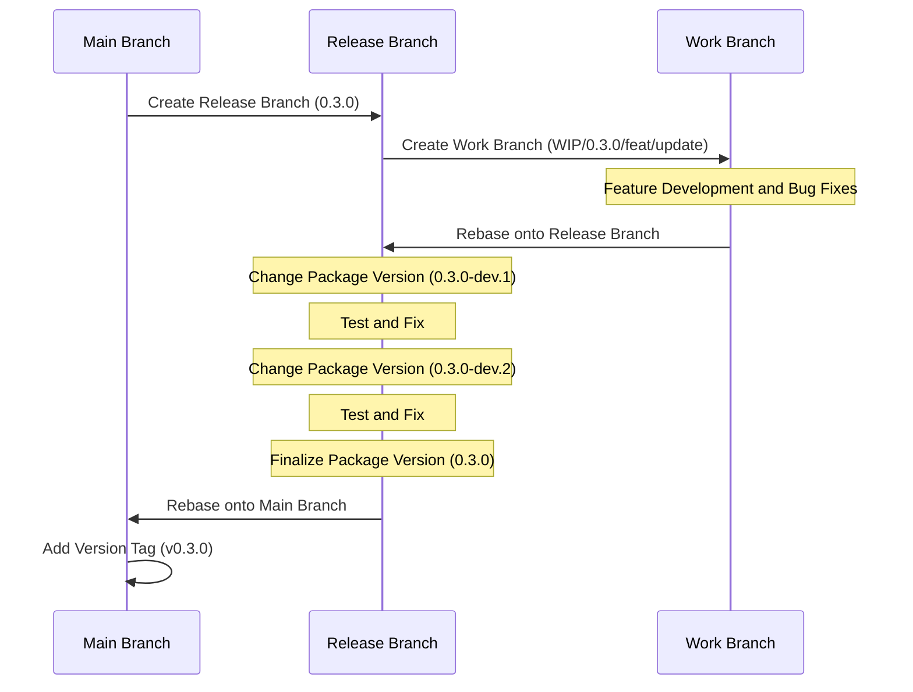

# Context Query

[한국어 문서(Korean Documentation)](./README.ko.md)

A lightweight, efficient state management library for React applications that provides component tree-scoped state with optimized rendering.

## Why Context Query?

React offers several ways to manage state, but each has limitations in specific scenarios:

1. **Global State (Redux, Zustand)** is designed for app-wide data sharing, not for specific component trees. It's also challenging to handle state based on component lifecycle.

2. **React Context API** creates scoped state within component trees, but causes unnecessary re-renders across all child components when any part of the context changes.

3. **React Query** excels at server state management but uses a global key-based approach, not ideal for component-scoped client state.

Context Query combines the best aspects of these approaches:

- **Component Tree Scoping**: Like Context API, state is tied to component lifecycle
- **Subscription Model**: Like React Query, only components that subscribe to specific state keys re-render
- **Simple API**: Familiar hook-based pattern similar to React's `useState`

## When to Use Context Query

Context Query is ideal for:

- **Component Groups**: When you need to share state among a group of components without prop drilling
- **Component-Scoped State**: When state should be tied to a specific component tree's lifecycle
- **Performance Critical UIs**: When you need to minimize re-renders in complex component hierarchies

### Choosing the Right Tool for State Management

Context Query is not a one-size-fits-all solution. For optimal performance and architecture, choose state management tools based on their intended purpose:

- **Global State (Redux, Zustand)**: Use for true application-wide state that needs to persist across the entire app
- **React Query**: Use for server state management and data fetching, which is its primary purpose
- **Context API**: Use for theme changes, locale settings, or other cases where you intentionally want all child components to re-render
- **Context Query**: Use when you need component tree-scoped state sharing without prop drilling, while preventing unnecessary sibling re-renders

## Features

- 🚀 **Granular Re-rendering**: Components only re-render when their specific subscribed state changes
- 🔄 **Component Lifecycle Integration**: State is automatically cleaned up when provider components unmount
- 🔌 **Simple API**: Familiar hook-based API similar to React's `useState`
- 🧩 **TypeScript Support**: Full type safety with TypeScript
- 📦 **Lightweight**: Minimal bundle size with zero dependencies
- 🔧 **Compatible**: Works alongside existing state management solutions

## Installation

```bash
# Using npm
npm install @context-query/react

# Using yarn
yarn add @context-query/react

# Using pnpm
pnpm add @context-query/react
```

## Usage

### 1. Create a Context Query Provider

```tsx
// CounterContextQueryProvider.tsx
import { createContextQuery } from "@context-query/react";

type CounterAtoms = {
  primaryCounter: {
    name: string;
    value: number;
    description: string;
  };
  secondaryCounter: {
    name: string;
    value: number;
    description: string;
  };
};

export const {
  ContextQueryProvider: CounterQueryProvider,
  useContextAtom: useCounterAtom,
  useContextAtomValue: useCounterAtomValue,
  useContextSetAtom: useCounterSetAtom,
} = createContextQuery<CounterAtoms>();
```

### 2. Wrap Your Component Tree with the Provider and Initialize Atoms

```tsx
// CounterApp.tsx
import { CounterQueryProvider } from "./CounterContextQueryProvider";

function CounterApp() {
  return (
    <CounterQueryProvider
      atoms={{
        primaryCounter: {
          name: "Primary Counter",
          value: 0,
          description: "Main counter that controls other counters",
        },
        secondaryCounter: {
          name: "Secondary Counter",
          value: 0,
          description: "Secondary counter linked to primary",
        },
      }}
    >
      <CounterContent />
    </CounterQueryProvider>
  );
}

function CounterContent() {
  return (
    <div className="counter-app">
      <PrimaryCounterComponent />
      <SecondaryCounterComponent />
    </div>
  );
}
```

### 3. Use Atoms in Your Components

```tsx
// PrimaryCounterComponent.tsx
import { useCounterAtom, useCounterSetAtom } from "./CounterContextQueryProvider";

function PrimaryCounterComponent() {
  // Subscribe to primary counter atom only
  const [primaryCounter, setPrimaryCounter] = useCounterAtom("primaryCounter");
  const setSecondaryCounter = useCounterSetAtom("secondaryCounter");

  const increment = () => {
    setPrimaryCounter((prev) => ({ ...prev, value: prev.value + 1 }));
    // Also update secondary counter
    setSecondaryCounter((prev) => ({ ...prev, value: prev.value + 1 }));
  };

  const decrement = () => {
    setPrimaryCounter((prev) => ({ ...prev, value: prev.value - 1 }));
  };

  const reset = () => {
    setPrimaryCounter((prev) => ({ ...prev, value: 0 }));
  };

  return (
    <div className="counter">
      <h2>{primaryCounter.name}</h2>
      <p>{primaryCounter.description}</p>
      <div className="counter-controls">
        <span>{primaryCounter.value}</span>
        <button onClick={decrement}>-</button>
        <button onClick={increment}>+</button>
        <button onClick={reset}>Reset</button>
      </div>
    </div>
  );
}

// SecondaryCounterComponent.tsx
import { useCounterAtomValue } from "./CounterContextQueryProvider";

function SecondaryCounterComponent() {
  // Read-only access to secondary counter atom
  const secondaryCounter = useCounterAtomValue("secondaryCounter");

  return (
    <div className="counter secondary">
      <h3>{secondaryCounter.name}</h3>
      <p>{secondaryCounter.description}</p>
      <div className="counter-display">
        <span>{secondaryCounter.value}</span>
      </div>
    </div>
  );
}

// BatchUpdateComponent.tsx
import { useCounterSetAtom } from "./CounterContextQueryProvider";

function BatchUpdateComponent() {
  const setPrimaryCounter = useCounterSetAtom("primaryCounter");
  const setSecondaryCounter = useCounterSetAtom("secondaryCounter");

  const resetAll = () => {
    setPrimaryCounter((prev) => ({ ...prev, value: 0 }));
    setSecondaryCounter((prev) => ({ ...prev, value: 0 }));
  };

  const incrementAll = () => {
    setPrimaryCounter((prev) => ({ ...prev, value: prev.value + 1 }));
    setSecondaryCounter((prev) => ({ ...prev, value: prev.value + 1 }));
  };

  return (
    <div className="batch-controls">
      <button onClick={resetAll}>Reset All Counters</button>
      <button onClick={incrementAll}>Increment All Counters</button>
    </div>
  );
}
```

This example demonstrates:

1. **Atom-based Architecture**: Each piece of state is managed as a separate atom
2. **Granular Subscriptions**: Components subscribe only to the atoms they need, optimizing re-renders
3. **Read-Write Separation**: Use `useContextAtom` for read-write access, `useContextAtomValue` for read-only access, and `useContextSetAtom` for write-only access
4. **Cross-Atom Updates**: Components can update multiple atoms independently

## Advanced Usage

### Available Hooks

The `createContextQuery` function returns a provider and seven hooks for different use cases:

```tsx
const {
  ContextQueryProvider,
  useContextAtom,        // Read-write access to an atom
  useContextAtomValue,   // Read-only access to an atom
  useContextSetAtom,     // Write-only access to an atom
  useStore,              // Direct store access
  useSnapshot,           // Read-write access to all atoms
  useSnapshotValue,      // Read-only access to all atoms
  usePatch,              // Write-only access to all atoms
} = createContextQuery<YourAtomTypes>();
```

### Hook Usage Patterns

#### `useContextAtom` - Read & Write
```tsx
function CounterComponent() {
  const [counter, setCounter] = useContextAtom("counter");
  
  const increment = () => {
    setCounter((prev) => ({ ...prev, value: prev.value + 1 }));
  };
  
  return (
    <div>
      <span>{counter.value}</span>
      <button onClick={increment}>+</button>
    </div>
  );
}
```

#### `useContextAtomValue` - Read Only
```tsx
function DisplayComponent() {
  const counter = useContextAtomValue("counter");
  
  return <div>Current value: {counter.value}</div>;
}
```

#### `useContextSetAtom` - Write Only
```tsx
function ControlComponent() {
  const setCounter = useContextSetAtom("counter");

  const reset = () => {
    setCounter((prev) => ({ ...prev, value: 0 }));
  };

  return <button onClick={reset}>Reset</button>;
}
```

#### `useStore` - Direct Store Access
```tsx
function AdvancedComponent() {
  const store = useStore();

  // Direct store API access for advanced use cases
  const value = store.getAtomValue("counter");
  store.setAtomValue("counter", newValue);
}
```

#### `useSnapshot` - Read & Write All Atoms
```tsx
function BatchComponent() {
  const [snapshot, patch] = useSnapshot();

  const resetAll = () => {
    patch({
      primaryCounter: { ...snapshot.primaryCounter, value: 0 },
      secondaryCounter: { ...snapshot.secondaryCounter, value: 0 },
    });
  };

  return <button onClick={resetAll}>Reset All</button>;
}
```

#### `useSnapshotValue` - Read Only All Atoms
```tsx
function DisplayAll() {
  const snapshot = useSnapshotValue();

  return <pre>{JSON.stringify(snapshot, null, 2)}</pre>;
}
```

#### `usePatch` - Write Only All Atoms
```tsx
function BatchControls() {
  const patch = usePatch();

  // This component won't re-render when atoms change
  const resetAll = () => {
    patch({
      primaryCounter: { value: 0, name: "Primary", description: "..." },
      secondaryCounter: { value: 0, name: "Secondary", description: "..." },
    });
  };

  return <button onClick={resetAll}>Reset All</button>;
}
```

### Function Updates

Similar to React's `useState`, you can pass a function to atom setters:

```tsx
const [counter, setCounter] = useContextAtom("counter");

// Update based on previous state
const increment = () => {
  setCounter((prev) => ({ ...prev, value: prev.value + 1 }));
};
```

### Multiple Providers

Using the same provider multiple times creates independent state instances:

```tsx
function App() {
  return (
    <div>
      {/* First counter instance */}
      <CounterQueryProvider atoms={{ counter: { value: 0, name: "First Counter" } }}>
        <CounterSection title="First Section" />
      </CounterQueryProvider>

      {/* Second counter instance (completely independent) */}
      <CounterQueryProvider atoms={{ counter: { value: 10, name: "Second Counter" } }}>
        <CounterSection title="Second Section" />
      </CounterQueryProvider>
    </div>
  );
}

function CounterSection({ title }) {
  const [counter, setCounter] = useCounterAtom("counter");
  
  return (
    <div>
      <h2>{title}</h2>
      <p>{counter.name}: {counter.value}</p>
      <button onClick={() => setCounter(prev => ({ ...prev, value: prev.value + 1 }))}>
        Increment
      </button>
    </div>
  );
}
```

Each provider maintains its own state, so changing one counter won't affect the other.

## Project Structure

The project consists of multiple packages:

- `@context-query/core`: Core functionality and state management
- `@context-query/react`: React bindings and hooks
- `playground`: Demo application showcasing the library

## Development

### Prerequisites

- Node.js >= 18
- pnpm >= 9.0.0

### Setup

```bash
# Clone the repository
git clone https://github.com/load28/context-query.git
cd context-query

# Install dependencies
pnpm install

# Build all packages
pnpm build

# Run the playground demo
pnpm playground
```

## Release Workflow



## License

MIT
