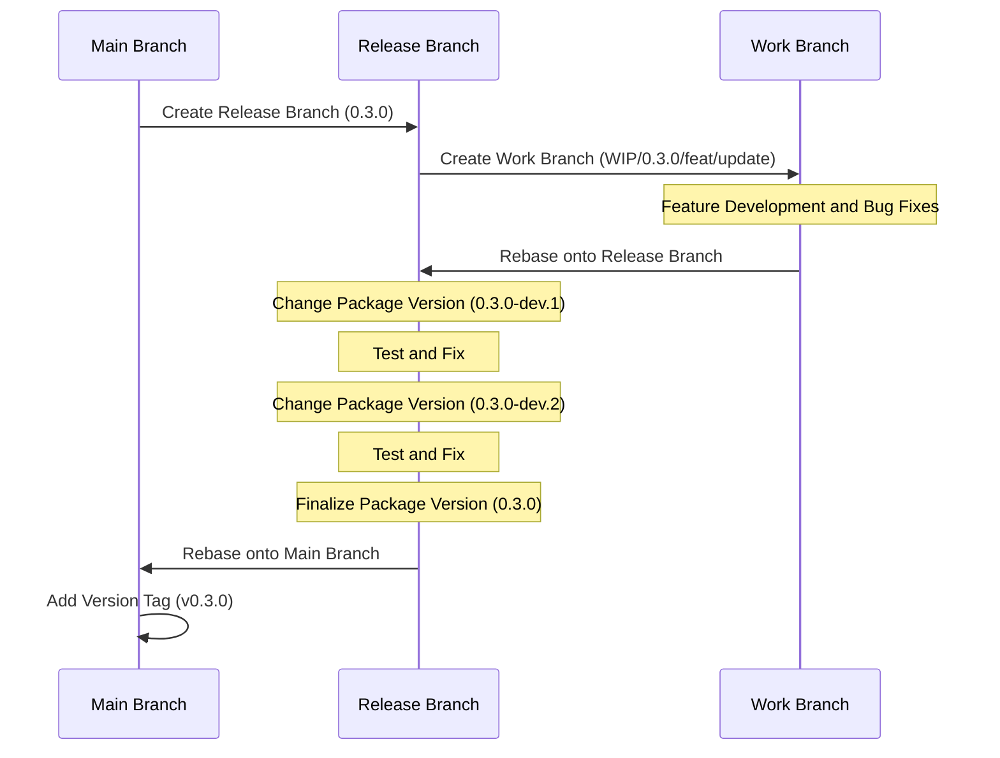

# Context Query

[한국어 문서(Korean Documentation)](./README.ko.md)

A lightweight, efficient state management library for React applications that provides component tree-scoped state with optimized rendering.

## Why Context Query?

React offers several ways to manage state, but each has limitations in specific scenarios:

1. **Global State (Redux, Zustand)** is designed for app-wide data sharing, not for specific component trees. It's also challenging to handle state based on component lifecycle.

2. **React Context API** creates scoped state within component trees, but causes unnecessary re-renders across all child components when any part of the context changes.

3. **React Query** excels at server state management but uses a global key-based approach, not ideal for component-scoped client state.

Context Query combines the best aspects of these approaches:

- **Component Tree Scoping**: Like Context API, state is tied to component lifecycle
- **Subscription Model**: Like React Query, only components that subscribe to specific state keys re-render
- **Simple API**: Familiar hook-based pattern similar to React's `useState`

## When to Use Context Query

Context Query is ideal for:

- **Component Groups**: When you need to share state among a group of components without prop drilling
- **Component-Scoped State**: When state should be tied to a specific component tree's lifecycle
- **Performance Critical UIs**: When you need to minimize re-renders in complex component hierarchies

### Choosing the Right Tool for State Management

Context Query is not a one-size-fits-all solution. For optimal performance and architecture, choose state management tools based on their intended purpose:

- **Global State (Redux, Zustand)**: Use for true application-wide state that needs to persist across the entire app
- **React Query**: Use for server state management and data fetching, which is its primary purpose
- **Context API**: Use for theme changes, locale settings, or other cases where you intentionally want all child components to re-render
- **Context Query**: Use when you need component tree-scoped state sharing without prop drilling, while preventing unnecessary sibling re-renders

## Features

- 🚀 **Granular Re-rendering**: Components only re-render when their specific subscribed state changes
- 🔄 **Component Lifecycle Integration**: State is automatically cleaned up when provider components unmount
- 🔌 **Simple API**: Familiar hook-based API similar to React's `useState`
- 🧩 **TypeScript Support**: Full type safety with TypeScript
- 📦 **Lightweight**: Minimal bundle size with zero dependencies
- 🔧 **Compatible**: Works alongside existing state management solutions

## Installation

```bash
# Using npm
npm install @context-query/react

# Using yarn
yarn add @context-query/react

# Using pnpm
pnpm add @context-query/react
```

## Usage

### 1. Create a Context Query Provider

```tsx
// UserContextQueryProvider.tsx
import { createContextQuery } from "@context-query/react";

interface UserData {
  name: string;
  email: string;
  preferences: {
    theme: "light" | "dark";
    notifications: boolean;
  };
}

export const {
  ContextQueryProvider: UserQueryProvider,
  useContextQuery: useUserQuery,
  useContextSetter: useUserSetter,
} = createContextQuery<UserData>();
```

### 2. Wrap Your Component Tree with the Provider and Initialize State

```tsx
// UserProfilePage.tsx
import { useEffect } from "react";
import { UserQueryProvider, useUserSetter } from "./UserContextQueryProvider";

async function fetchUserData(userId: string) {
  const response = await fetch(`/api/users/${userId}`);
  return response.json();
}

function UserProfilePage({ userId }: { userId: string }) {
  const initialState = {
    name: "",
    email: "",
    preferences: {
      theme: "light" as const,
      notifications: true,
    },
  };

  return (
    <UserQueryProvider initialState={initialState}>
      <UserProfileContent userId={userId} />
    </UserQueryProvider>
  );
}

function UserProfileContent({ userId }: { userId: string }) {
  const setUserState = useUserSetter();

  useEffect(() => {
    // Initialize state with external data
    const loadUserData = async () => {
      const userData = await fetchUserData(userId);
      setUserState(userData); // Update entire state with fetched data
    };
    loadUserData();
  }, [userId, setUserState]);

  return (
    <div className="user-profile">
      <UserInfoForm />
      <UserPreferencesForm />
      <SaveButton />
    </div>
  );
}
```

### 3. Use the State in Your Components

```tsx
// UserInfoForm.tsx
import { useUserQuery } from "./UserContextQueryProvider";

function UserInfoForm() {
  // Subscribe to user info fields only
  const [state, setState] = useUserQuery(["name", "email"]);

  return (
    <div className="user-info">
      <h3>Basic Information</h3>
      <div>
        <label>Name:</label>
        <input
          value={state.name}
          onChange={(e) =>
            setState((prev) => ({ ...prev, name: e.target.value }))
          }
        />
      </div>
      <div>
        <label>Email:</label>
        <input
          value={state.email}
          onChange={(e) =>
            setState((prev) => ({ ...prev, email: e.target.value }))
          }
        />
      </div>
    </div>
  );
}

// UserPreferencesForm.tsx
import { useUserQuery } from "./UserContextQueryProvider";

function UserPreferencesForm() {
  // Subscribe to preferences only
  const [state, setState] = useUserQuery(["preferences"]);

  const toggleTheme = () => {
    setState((prev) => ({
      ...prev,
      preferences: {
        ...prev.preferences,
        theme: prev.preferences.theme === "light" ? "dark" : "light",
      },
    }));
  };

  const toggleNotifications = () => {
    setState((prev) => ({
      ...prev,
      preferences: {
        ...prev.preferences,
        notifications: !prev.preferences.notifications,
      },
    }));
  };

  return (
    <div className="user-preferences">
      <h3>User Preferences</h3>
      <div>
        <label>Theme: {state.preferences.theme}</label>
        <button onClick={toggleTheme}>Toggle Theme</button>
      </div>
      <div>
        <label>
          <input
            type="checkbox"
            checked={state.preferences.notifications}
            onChange={toggleNotifications}
          />
          Enable Notifications
        </label>
      </div>
    </div>
  );
}

// SaveButton.tsx
import { useUserQuery, useUserSetter } from "./UserContextQueryProvider";

function SaveButton() {
  // Get all user data for saving
  const [userData] = useUserQuery(["name", "email", "preferences"]);
  const setUserState = useUserSetter();

  const handleSave = async () => {
    try {
      const response = await fetch("/api/users/update", {
        method: "POST",
        body: JSON.stringify(userData),
      });
      const updatedUser = await response.json();

      // Update entire state with server response
      setUserState(updatedUser);
    } catch (error) {
      console.error("Failed to save user data:", error);
    }
  };

  return <button onClick={handleSave}>Save Changes</button>;
}
```

This example demonstrates:

1. Separation of concerns by splitting user information and preferences into separate components
2. Each component subscribes only to the state it needs, optimizing re-renders
3. Components can independently update their relevant portions of the state

## Advanced Usage

### Function Updates

Similar to React's `useState`, you can pass a function to the state setter:

```tsx
const [{ count1 }, setState] = useCounterQuery(["count1"]);

// Update based on previous state
const increment = () => {
  setState((prev) => ({ ...prev, count1: prev.count1 + 1 }));
};
```

### Update Multiple States

You can update multiple states at once using the `useContextSetter` hook:

```tsx
import { useCounterSetter } from "./CounterContextQueryProvider";

function BatchUpdateComponent() {
  const setState = useCounterSetter();

  // Update multiple states at once
  const resetCounters = () => {
    setState({
      count1: 0,
      count2: 0,
      count3: 0,
    });
  };

  // Or use a function to update based on previous state
  const incrementAll = () => {
    setState((prev) => ({
      count1: prev.count1 + 1,
      count2: prev.count2 + 1,
      count3: prev.count3 + 1,
    }));
  };

  return (
    <div>
      <button onClick={resetCounters}>Reset All</button>
      <button onClick={incrementAll}>Increment All</button>
    </div>
  );
}
```

### Multiple Providers

You can use multiple providers for different component subtrees:

```tsx
function App() {
  return (
    <div>
      <FeatureAProvider>
        <FeatureAComponents />
      </FeatureAProvider>

      <FeatureBProvider>
        <FeatureBComponents />
      </FeatureBProvider>
    </div>
  );
}
```

## Project Structure

The project consists of multiple packages:

- `@context-query/core`: Core functionality and state management
- `@context-query/react`: React bindings and hooks
- `playground`: Demo application showcasing the library

## Development

### Prerequisites

- Node.js >= 18
- pnpm >= 9.0.0

### Setup

```bash
# Clone the repository
git clone https://github.com/load28/context-query.git
cd context-query

# Install dependencies
pnpm install

# Build all packages
pnpm build

# Run the playground demo
pnpm playground
```

## Release Workflow



## License

MIT
