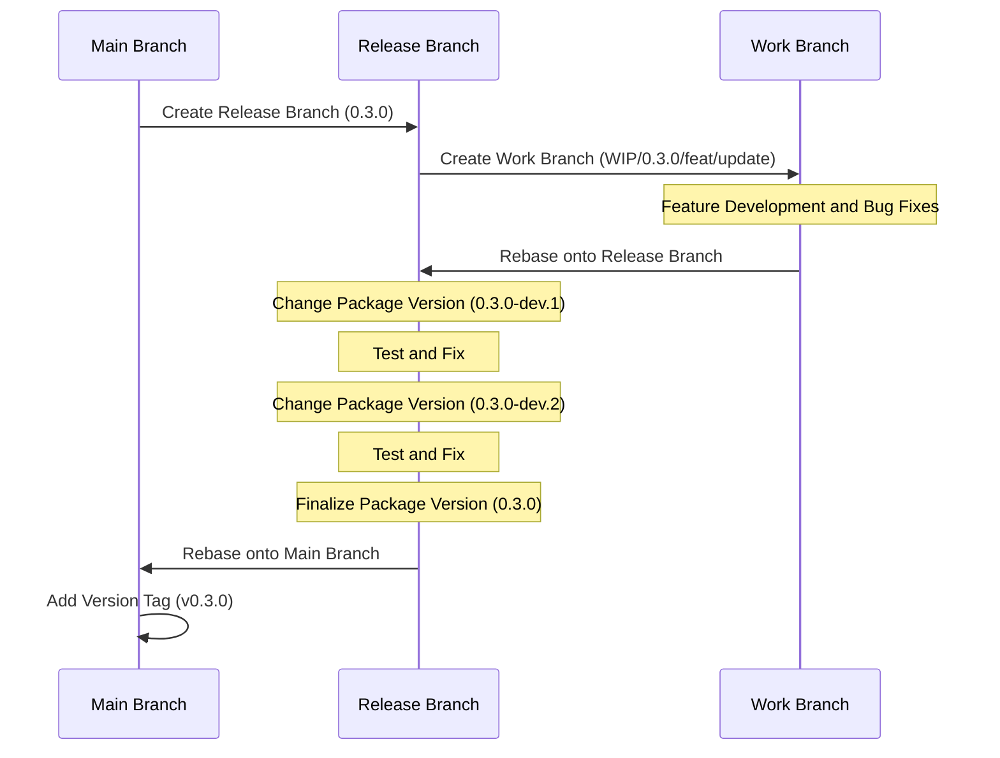

# Context Query

[한국어 문서(Korean Documentation)](./README.ko.md)

A lightweight, efficient state management library for React applications that provides component tree-scoped state with optimized rendering.

## Why Context Query?

React offers several ways to manage state, but each has limitations in specific scenarios:

1. **Global State (Redux, Zustand)** is designed for app-wide data sharing, not for specific component trees. It's also challenging to handle state based on component lifecycle.

2. **React Context API** creates scoped state within component trees, but causes unnecessary re-renders across all child components when any part of the context changes.

3. **React Query** excels at server state management but uses a global key-based approach, not ideal for component-scoped client state.

Context Query combines the best aspects of these approaches:

- **Component Tree Scoping**: Like Context API, state is tied to component lifecycle
- **Subscription Model**: Like React Query, only components that subscribe to specific state keys re-render
- **Simple API**: Familiar hook-based pattern similar to React's `useState`

## When to Use Context Query

Context Query is ideal for:

- **Component Groups**: When you need to share state among a group of components without prop drilling
- **Component-Scoped State**: When state should be tied to a specific component tree's lifecycle
- **Performance Critical UIs**: When you need to minimize re-renders in complex component hierarchies

### Choosing the Right Tool for State Management

Context Query is not a one-size-fits-all solution. For optimal performance and architecture, choose state management tools based on their intended purpose:

- **Global State (Redux, Zustand)**: Use for true application-wide state that needs to persist across the entire app
- **React Query**: Use for server state management and data fetching, which is its primary purpose
- **Context API**: Use for theme changes, locale settings, or other cases where you intentionally want all child components to re-render
- **Context Query**: Use when you need component tree-scoped state sharing without prop drilling, while preventing unnecessary sibling re-renders

## Features

- 🚀 **Granular Re-rendering**: Components only re-render when their specific subscribed state changes
- ⚡ **Signal-based Reactive Engine**: Push-pull hybrid reactivity inspired by [TC39 Signals](https://github.com/tc39/proposal-signals) and [Alien Signals](https://github.com/nicepkg/alien-signals)
- 🔄 **Component Lifecycle Integration**: State is automatically cleaned up when provider components unmount
- 🧮 **Derived State**: Automatically computed values with diamond-problem resolution and lazy evaluation
- 🔌 **Simple API**: Familiar hook-based API similar to React's `useState`
- 🧩 **TypeScript Support**: Full type safety with TypeScript
- 📦 **Lightweight**: ~2.8KB gzipped (core) with zero dependencies
- 🔧 **Compatible**: Works alongside existing state management solutions

## Installation

```bash
# Using npm
npm install @context-query/react

# Using yarn
yarn add @context-query/react

# Using pnpm
pnpm add @context-query/react
```

## Usage

### 1. Define Your Provider

```tsx
// TodoProvider.tsx
import { createContextQuery } from "@context-query/react";
import { derived, atom } from "@context-query/core";
import { shallowEqual } from "@context-query/core";

type Todo = { id: number; text: string; done: boolean };

type TodoAtoms = {
  todos: Todo[];
  filter: "all" | "active" | "done";
  filteredTodos: Todo[];
  stats: { total: number; active: number; done: number };
};

export const {
  ContextQueryProvider: TodoProvider,
  useContextAtom: useTodoAtom,
  useContextAtomValue: useTodoValue,
  useContextSetAtom: useTodoSet,
} = createContextQuery<TodoAtoms>();
```

### 2. Initialize with Atoms, Derived State, and Custom Equality

```tsx
// App.tsx
import { TodoProvider } from "./TodoProvider";
import { derived, atom } from "@context-query/core";
import { shallowEqual } from "@context-query/core";

function App() {
  return (
    <TodoProvider
      atoms={{
        todos: atom([] as Todo[], { equalityFn: shallowEqual }),
        filter: "all",
        // Derived: auto-computed from todos + filter
        filteredTodos: derived((get) => {
          const todos = get("todos");
          const filter = get("filter");
          if (filter === "active") return todos.filter((t) => !t.done);
          if (filter === "done") return todos.filter((t) => t.done);
          return todos;
        }),
        // Derived: stats auto-computed from todos
        stats: derived((get) => {
          const todos = get("todos");
          return {
            total: todos.length,
            active: todos.filter((t) => !t.done).length,
            done: todos.filter((t) => t.done).length,
          };
        }),
      }}
    >
      <TodoApp />
    </TodoProvider>
  );
}
```

### 3. Use in Components

```tsx
// Only re-renders when filteredTodos changes
function TodoList() {
  const todos = useTodoValue("filteredTodos");

  return (
    <ul>
      {todos.map((todo) => (
        <TodoItem key={todo.id} id={todo.id} />
      ))}
    </ul>
  );
}

// Read-write access to todos
function TodoItem({ id }: { id: number }) {
  const [todos, setTodos] = useTodoAtom("todos");
  const todo = todos.find((t) => t.id === id);

  const toggle = () => {
    setTodos((prev) =>
      prev.map((t) => (t.id === id ? { ...t, done: !t.done } : t))
    );
  };

  return (
    <li onClick={toggle} style={{ textDecoration: todo?.done ? "line-through" : "none" }}>
      {todo?.text}
    </li>
  );
}

// Write-only: no re-render when todos change
function AddTodo() {
  const setTodos = useTodoSet("todos");

  const add = (text: string) => {
    setTodos((prev) => [...prev, { id: Date.now(), text, done: false }]);
  };

  return <button onClick={() => add("New task")}>Add</button>;
}

// Read-only: only re-renders when stats change
function Stats() {
  const stats = useTodoValue("stats");

  return (
    <div>
      Total: {stats.total} | Active: {stats.active} | Done: {stats.done}
    </div>
  );
}

// Filter buttons: write-only, no re-render
function FilterButtons() {
  const setFilter = useTodoSet("filter");

  return (
    <div>
      <button onClick={() => setFilter("all")}>All</button>
      <button onClick={() => setFilter("active")}>Active</button>
      <button onClick={() => setFilter("done")}>Done</button>
    </div>
  );
}
```

This example demonstrates:

1. **`derived()`**: `filteredTodos` and `stats` auto-compute from `todos` and `filter`
2. **`atom()` + `shallowEqual`**: Prevents unnecessary re-renders for reference-equal objects
3. **Granular Subscriptions**: Each component subscribes only to what it needs
4. **Read-Write Separation**: `useTodoValue` (read-only), `useTodoSet` (write-only), `useTodoAtom` (both)

## Architecture

Context Query is powered by a **signal-based reactive engine** that provides efficient state propagation:

```
┌─────────────────────────────────────────────────┐
│  React Hooks Layer (@context-query/react)        │
│  useContextAtom, useSnapshot, usePatch, ...      │
├─────────────────────────────────────────────────┤
│  Store Layer (@context-query/core)               │
│  ContextQueryStore, AtomStore, DerivedAtomStore   │
├─────────────────────────────────────────────────┤
│  Signal Engine (internal)                        │
│  signal → computed → effect (push-pull hybrid)   │
│  Diamond problem resolution, batch updates       │
└─────────────────────────────────────────────────┘
```

Each `ContextQueryProvider` creates an isolated reactive system, ensuring multiple providers never interfere with each other.

## Derived State

Use `derived()` to create computed atoms that automatically update when their dependencies change:

```tsx
import { createContextQuery } from "@context-query/react";
import { derived } from "@context-query/core";

type CartAtoms = {
  items: Array<{ name: string; price: number; qty: number }>;
  discount: number;
  totalPrice: number;
  finalPrice: number;
};

const { ContextQueryProvider, useContextAtomValue } = createContextQuery<CartAtoms>();

function CartApp() {
  return (
    <ContextQueryProvider
      atoms={{
        items: [
          { name: "Laptop", price: 1200, qty: 1 },
          { name: "Mouse", price: 35, qty: 2 },
        ],
        discount: 0.1,
        totalPrice: derived((get) => {
          const items = get("items");
          return items.reduce((sum, item) => sum + item.price * item.qty, 0);
        }),
        finalPrice: derived((get) => {
          return Math.round(get("totalPrice") * (1 - get("discount")));
        }),
      }}
    >
      <CartSummary />
    </ContextQueryProvider>
  );
}

function CartSummary() {
  const total = useContextAtomValue("totalPrice");    // auto-computed
  const final = useContextAtomValue("finalPrice");    // auto-computed
  return <div>Total: ${total} → Final: ${final}</div>;
}
```

Derived atoms are **lazy** (only computed when read) and **efficient** (diamond dependencies are resolved in a single pass).

## Atom Configuration

Use `atom()` to configure custom equality for atoms, preventing unnecessary re-renders:

```tsx
import { atom } from "@context-query/core";
import { shallowEqual } from "@context-query/core";

<ContextQueryProvider
  atoms={{
    // With shallowEqual, setting { name: "John", age: 30 } again won't trigger re-renders
    user: atom({ name: "John", age: 30 }, { equalityFn: shallowEqual }),
    label: derived((get) => `Hello, ${get("user").name}`),
  }}
>
  {children}
</ContextQueryProvider>
```

## Advanced Usage

### Available Hooks

The `createContextQuery` function returns a provider and seven hooks for different use cases:

```tsx
const {
  ContextQueryProvider,
  useContextAtom,        // Read-write access to an atom
  useContextAtomValue,   // Read-only access to an atom
  useContextSetAtom,     // Write-only access to an atom
  useStore,              // Direct store access
  useSnapshot,           // Read-write access to all atoms
  useSnapshotValue,      // Read-only access to all atoms
  usePatch,              // Write-only access to all atoms
} = createContextQuery<YourAtomTypes>();
```

### Hook Usage Patterns

#### `useContextAtom` - Read & Write
```tsx
function CounterComponent() {
  const [counter, setCounter] = useContextAtom("counter");
  
  const increment = () => {
    setCounter((prev) => ({ ...prev, value: prev.value + 1 }));
  };
  
  return (
    <div>
      <span>{counter.value}</span>
      <button onClick={increment}>+</button>
    </div>
  );
}
```

#### `useContextAtomValue` - Read Only
```tsx
function DisplayComponent() {
  const counter = useContextAtomValue("counter");
  
  return <div>Current value: {counter.value}</div>;
}
```

#### `useContextSetAtom` - Write Only
```tsx
function ControlComponent() {
  const setCounter = useContextSetAtom("counter");

  const reset = () => {
    setCounter((prev) => ({ ...prev, value: 0 }));
  };

  return <button onClick={reset}>Reset</button>;
}
```

#### `useStore` - Direct Store Access
```tsx
function AdvancedComponent() {
  const store = useStore();

  // Direct store API access for advanced use cases
  const value = store.getAtomValue("counter");
  store.setAtomValue("counter", newValue);
}
```

#### `useSnapshot` - Read & Write All Atoms
```tsx
function BatchComponent() {
  const [snapshot, patch] = useSnapshot();

  const resetAll = () => {
    patch({
      primaryCounter: { ...snapshot.primaryCounter, value: 0 },
      secondaryCounter: { ...snapshot.secondaryCounter, value: 0 },
    });
  };

  return <button onClick={resetAll}>Reset All</button>;
}
```

#### `useSnapshotValue` - Read Only All Atoms
```tsx
function DisplayAll() {
  const snapshot = useSnapshotValue();

  return <pre>{JSON.stringify(snapshot, null, 2)}</pre>;
}
```

#### `usePatch` - Write Only All Atoms
```tsx
function BatchControls() {
  const patch = usePatch();

  // This component won't re-render when atoms change
  const resetAll = () => {
    patch({
      primaryCounter: { value: 0, name: "Primary", description: "..." },
      secondaryCounter: { value: 0, name: "Secondary", description: "..." },
    });
  };

  return <button onClick={resetAll}>Reset All</button>;
}
```

### Error Handling

Handle errors in derived atoms with the `onError` callback:

```tsx
import { ContextQueryStore, derived } from "@context-query/core";

const store = new ContextQueryStore(
  {
    data: '{"count": 42}',
    parsed: derived((get) => JSON.parse(get("data"))),
  },
  {
    onError: (error, { key, type }) => {
      console.error(`Error in ${type} atom "${key}":`, error.message);
    },
  }
);

// Check for errors
store.getAtomError("parsed"); // null or Error
```

### Reset Atoms

Reset individual atoms or all atoms to their initial values:

```tsx
import { RESET } from "@context-query/core";

const store = new ContextQueryStore({ count: 0, name: "initial" });

store.setAtomValue("count", 42);
store.resetAtom("count");          // → 0
store.setAtomValue("count", RESET); // also resets to 0
store.resetAll();                   // reset everything
```

### Store API

Access the store directly for advanced operations:

```tsx
function AdvancedUsage() {
  const store = useStore();

  // Batch update multiple atoms
  store.patch({ count: 10, name: "updated" });

  // Get all atom values as a snapshot (cached, same reference if unchanged)
  const snapshot = store.getSnapshot();

  // Debug: inspect dependency graph and atom info
  console.log(store.getDependencyGraph());
  // → { filteredTodos: ["todos", "filter"], stats: ["todos"] }

  console.log(store.getDebugInfo());
  // → { count: { value: 10, subscriberCount: 2, isDerived: false }, ... }
}
```

### Function Updates

Similar to React's `useState`, you can pass a function to atom setters:

```tsx
const [counter, setCounter] = useContextAtom("counter");

// Update based on previous state
const increment = () => {
  setCounter((prev) => ({ ...prev, value: prev.value + 1 }));
};
```

### Multiple Providers

Using the same provider multiple times creates independent state instances:

```tsx
function App() {
  return (
    <div>
      {/* First counter instance */}
      <CounterQueryProvider atoms={{ counter: { value: 0, name: "First Counter" } }}>
        <CounterSection title="First Section" />
      </CounterQueryProvider>

      {/* Second counter instance (completely independent) */}
      <CounterQueryProvider atoms={{ counter: { value: 10, name: "Second Counter" } }}>
        <CounterSection title="Second Section" />
      </CounterQueryProvider>
    </div>
  );
}

function CounterSection({ title }) {
  const [counter, setCounter] = useCounterAtom("counter");
  
  return (
    <div>
      <h2>{title}</h2>
      <p>{counter.name}: {counter.value}</p>
      <button onClick={() => setCounter(prev => ({ ...prev, value: prev.value + 1 }))}>
        Increment
      </button>
    </div>
  );
}
```

Each provider maintains its own state, so changing one counter won't affect the other.

## Live Playground

Try the interactive playground: [https://load28.github.io/context-query/](https://load28.github.io/context-query/)

## Project Structure

The project consists of multiple packages:

- `@context-query/core`: Core signal engine, store layer, and state management
- `@context-query/react`: React bindings and hooks
- `playground`: Interactive demo application ([live](https://load28.github.io/context-query/))

## Development

### Prerequisites

- Node.js >= 18
- pnpm >= 9.0.0

### Setup

```bash
# Clone the repository
git clone https://github.com/load28/context-query.git
cd context-query

# Install dependencies
pnpm install

# Build all packages
pnpm build

# Run the playground demo
pnpm playground
```

## Release Workflow



## License

MIT
